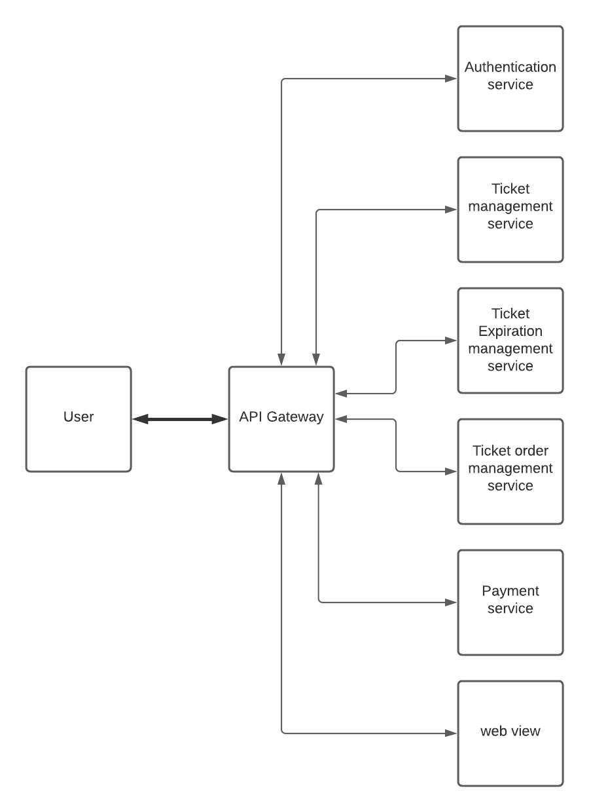
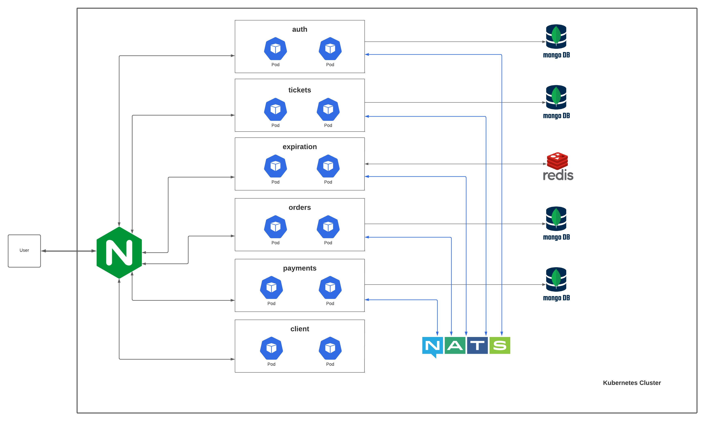

# Ticketing
Simple app for online buying movie tickets (system design).

- [Requirements](#requirements)
- [System design](#system-design)
  - [1. High level design](#1-high-level-design)
  - [2. Detailed design](#2-detailed-design)
    - [Why Microservices and Kubernetes](#why-microservices-and-kubernetes)
    - [Data modeling](#data-modeling)
    - [a. Ingress-nginx](#a-ingress-nginx)
    - [b. NATS Streaming Server](#b-nats-streaming-server)
    - [c. Authentication service (auth)](#c-authentication-service-auth)
    - [d. Ticket management service (tickets)](#d-ticket-management-service-tickets)
    - [e. Order management service (orders)](#e-order-management-service-orders)
    - [f. Expiration management service (expiration)](#f-expiration-management-service-expiration)
    - [g. Payment services (payments)](#g-payment-services-payments)
    - [h. Web view (client)](#h-web-view-client)
    - [i. Code share between services](#i-code-share-between-services)
- [Technicals](#technicals)  
- [Software development principles](#software-development-principles)
- [How to run](#how-to-run)  
  - [1. Setup](#1-setup)
  - [2. API document](#2-api-document)

## Requirements
Building a simple application helps order, buy and pay for tickets. 
- The application is simply a simple web page that shows all the tickets and let customers order those tickets.
- The application can handle a million of orders in seconds, and can make it expired if the customers do not pay for them within 15 minutes.  
- The application must be high available, resilient and easy to scale.

## System design
### 1. High level design
At a high-level, we need some following services (or components) to handle above requirements:


- **API Gateway**: Route requests to multiple services using a single endpoint. This service allows us to expose multiple services on a single endpoint and route to the appropriate service based on the request.
- **Authentication service**: Authenticate and sign up customers.
- **Ticket management service**: Management tickets with CRUD operations.
- **Ticket expiration management service**: Gather and management all the pending orders, check if valid or timeout.
- **Ticket Order management service**: Management orders, allow customers to place or delete orders.
- **Payment Service**: Take the responsibility for API to purchase tickets.
### 2. Detailed design

#### Why Microservices and Kubernetes
**Why Microservices**
- Microservices can be deployed in isolation, which facilitates continuous delivery.
- They are isolated in respect to failures, which improves robustness.
- The same is true for scalability. Each microservice can be scaled independently of the other microservices.
- The employed technologies can be chosen for each microservice in isolation, which allows for free technology choice.
- The microservices are isolated in such a way that they can only communicate via the network. Therefore, communication can be safeguarded by firewalls, which increases security.
- Due to this strong isolation, the boundaries between modules cannot be violated by mistake. The architecture is rarely violated; this safeguards the architecture.
- In isolation, a microservice can be replaced with a new microservice. This enables the low-risk replacement of microservices and allows one to keep the architecture of the individual microservices clean. Thus, isolation facilitates the long-term maintainability of the software.
- Decoupling is an important feature of modules. With their isolation, microservices push it to the extremes. Modules are normally only decoupled in regard to code changes and architecture. The decoupling between microservices goes far beyond that. Thanks to decoupling, microservices are smaller.

**Why Kubernetes**

Kubernetes provide out-of-the-box features help microservices work efficiently. It orchestrates and scales microservices with service discovery and load balancing. Moreover, it also has a mechanism to help recover and deploy new services.   

#### Data modeling
The scope of this service is still minimal, so I just use MongoDB to store the data. But one thing we need to solve is that removing the single point of failure in database. For this issue, I chose to implement each MongoDB for each service. We can easy to scale more replica for also read and write the data. And even when the other services is down, this service still has it own database and keep working. This design follows AP in CAP theorem. 

#### a. Ingress-nginx
Ingress-nginx is a Kubernetes resource. With ingress-nginx, we can have a service works as a load balancer and ingress for our application. Base on the requests, it will forward to the right service. Additional, we can easily scale more instances for each service and ingress-nginx makes sure they still work like normal base on the service name in configuration.

#### b. NATS Streaming Server
NATS Streaming Server is a message broker, it is extremely fast, easy to apply and use. We can use the durable queue for guaranteed message delivery, and the pub-sub pattern to communicate the microservices to each others.

#### c. Authentication service (auth)
- Single point to authenticate our customers: simplify our downstream microservice, these services just need to verify/validate the access token of users.
- Store data about our customer: Provide API for login, logout and register users. This service use JWT to let the users access to the application.
  - After registering, users use email and password to login. When authenticate successfully, a JWT is attached to the cookies and sent back to users. This behavior is not only make sure the security fot this flow but also solve the issue first request in client module.
- In the case we don't want to use a custom service, we could use Keycloak - an open source identity solution provides the same capacities.
    
#### d. Ticket management service (tickets)
- Provide API for create, update, and list all tickets.
- A central place for pub-sub events related to ticket via NATS streaming server.

#### e. Order management service (orders)
- Provide API for create, delete, and list all orders.
- One thing we need to handle in this module is concurrent issue.
  - In case a lot of events to update 1 ticket's order at the same time, but these events come to different replica order service, so each replica can handle to change the state of the ticket's order in the wrong order. My solution for this case is using the version feature of MongoDB to manage the next action for the order. whenever the order is updated, the version if this order is check first and then increase to track for the next one.

#### f. Expiration management service (expiration)
- Do the job expire the order after 15 minutes.
- 2 others alternative way instead of create this service:
  - Set timeout for the orders in order service. The disadvantage of this way is if the order service is down, all the tasks to expire the orders are gone.
  - Use the redelivery mechanism of Nats streaming server: the event is automatically resend when the time is out. The disadvantages of this way are we can lose the task if the events have errors, and it is complicated when we want to custom the behavior of NATS in some cases like we want to have some alert if we resend several times.
- For all the reasons above, This service is built to manage the schedule job for expiration. This service is run along with Redis and [Bull](https://www.npmjs.com/package/bull). To save the effort for creating more service, the expiration service will play the role for both the caller and the worker to handle the expiration job, Redis and Bull are the queue-delay, make sure the service does not handle a lot of job in the same time, also solve the issue the jobs are gone when the service is down.    

#### g. Payment services (payments)
- Provide API to charge the orders.
- Integrate with [Stripe](https://stripe.com/) to let the customers can pay by multiple methods.

#### h. Web view (client)
- Interact with the customers, powered by [React](https://reactjs.org/) and [NextJS](https://nextjs.org/) framework.
- The client service is implemented follow server side rendering (SSR): 
  - The customers do not need to way too long for the first load when come to our page.
  - We can SEO the application more effective.
- The SSR brings 1 drawback that with the first request for login and the response send back to the client, we need this request run 2 times: 1 for getting the JWT and process and then loading components. The function to attach the JWT to cookie in auth service is apply to solve this issue.   

#### i. Code quality and sharing between services
- With every single API in this application, it does cover by unittest with jest and supertest. Moreover, you can you the [TravisCI](https://travis-ci.org/) and **.travis.yml** file to enable CI-CD for this project.
- One of the disadvantage of microservices is the inconsistency between each service. In this application, we have a lot of things need to share between services: the format of the errors, the responses of the API, the states of the ticket, the events of the NATS streaming server. To make the sharing efficient and do not waste resources for deploy 1 more common service, I chose the build a npm package. When 1 service want to use the shared code, it just installs this package and imports the code. When we want to update the shared code, we just increase the version of this package and publish it. 
- The package: https://www.npmjs.com/package/@joker7nbt-ticketing/common

## Technicals
- Javascript, TypeScript
- NodeJs 
- React, NextJs 
- MongoDB 
- NATS Streaming Server
- Redis
- Docker, Kubernetes

## Software development principles
### KISS (Keep It Simple Stupid)
- Most systems work best if they are kept simple rather than made complex.
- Less code takes less time to write, has less bugs, and is easier to modify.
- > The best design is the simplest one that works - Albert Einstein.

**What applied:** Keep system design and the implementation code simple

### YAGNI (You aren't gonna need it)
- Don't implement something until it is necessary.
- Any work that's only used for a feature that's needed tomorrow, means losing effort from features that need to be done for the current iteration.

**What applied:** Always implement things when we actually need them, never when we just foresee that we need them.

### Separation of Concerns
- Separating a system into multiple distinct microservices, such that each service addresses a separate concern (product, order, shopping cart...).
- In each service, break program functionality into separate layers (as show in Project folder structure).

### DRY
- Put business rules, long expressions, if statements, math formulas, metadata, etc. in only one place.

### Avoid Premature Optimization
- It is unknown upfront where the bottlenecks will be.
- After optimization, it might be harder to read and thus maintain.

**What applied:** Don't optimize until we need to, and only after profiling we discover a bottleneck optimise that.

### Single Responsibility Principle
Every class should have a single responsibility, and that responsibility should be entirely encapsulated by the class. Responsibility can be defined as a reason to change, so a class or module should have one, and only one, reason to change.

**What applied:** break system into multiple services, each services has only one responsibility. In each services, break into multiple layers, each layers were broken into multiple classes, each class has only one reason to change.


## How to run
### 1. Setup
The setup development process is simpler than ever with following steps:
1. Install [NodeJS](https://nodejs.org/)
1. Install [Docker](https://www.docker.com/) and start Docker also Kubernetes.
1. Install [Ingress-nginx](https://kubernetes.github.io/ingress-nginx/). 
   - Please notice that with different version of ingress-nginx, the namespace can be change or not, so follow this step to setup the namespace:
      - Run and get the **service-name** and **name-space**
      > kubectl get namespace và kubectl get service -n {ingress-nginx-namespace}
      - Find **INGRESS_NGINX_NAME_SPACE** variable and change to **{service-name}.{namespace}**
      - The **INGRESS_NGINX_NAME_SPACE** has already set up for ingress-nginx version **0.44.0**. So if you use this version you can ignore these setting steps.
1. Install [Scaffold](https://skaffold.dev/) to run all services automatically
1. Clone this project to your local machine.
1. Open terminal and make sure you're at the root directory of this project, run the command ```scaffold run``` (this will automatically setup NATS, MongoDB and Redis for you).

### 2. API document
From the client's point of view, all the requests will be handled by only one single point - our ingress-nginx.

Please refer [Ticketing API Documentation](https://documenter.getpostman.com/view/4560261/U16ev8EL) for full request endpoint, HTTP Headers and request payload with example requests and responses.

